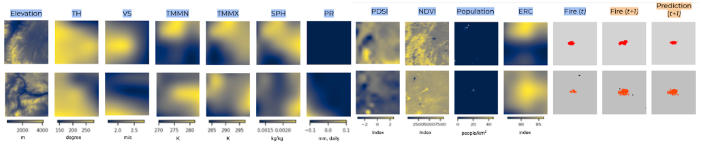
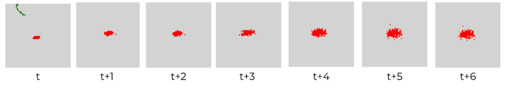

# FireSight: Utilizing Deep Learning for Wildfire Prediction And Determining Escape Routes

## Overview
This project implements a machine learning system for predicting wildfire occurrences using various deep learning architectures. The system processes environmental data including terrain height, temperature, humidity, wind speed, and other relevant features to predict fire presence in a given area. The original code for this project is available here: https://colab.research.google.com/drive/1DkgCx6WjrmhgcBvnwuEhaSakB6I0f0q4. A manuscript regarding this work can be found: https://eartharxiv.org/repository/view/5972/

## Features
- Multiple deep learning model implementations:
  - ResNet50 and ResNet101
  - EfficientNet and EfficientNetV2S
  - RegNet
  - VGG19
  - Logistic Regression
  - Random Forest
- K-fold cross-validation for robust model evaluation
- Comprehensive evaluation metrics including accuracy, precision, recall, AUC, and MAE
- Visualization of training progress and model comparisons

## Data
The project uses TFRecord datasets containing the following input features:
- Elevation (terrain height)
- Temperature Humidity Index (THI)
- Wind Speed (VS)
- Minimum Temperature (TMMN)
- Maximum Temperature (TMMX)
- Specific Humidity (SPH)
- Precipitation (PR)
- Palmer Drought Severity Index (PDSI)
- Normalized Difference Vegetation Index (NDVI)
- Population Density
- Energy Release Component (ERC)
- Previous Fire Mask

## Model Architectures

### ResNet Models
- ResNet50 and ResNet101 implementations with custom top layers
- Pre-trained weights not used (training from scratch)
- Global average pooling and dense layers for fire prediction

### EfficientNet Models
- EfficientNet and EfficientNetV2S implementations
- Improved training efficiency and model scaling
- Custom convolutional and dense layers for feature refinement

### RegNet
- RegNetX080 implementation
- Design space for efficient CNNs
- Custom top layers for fire prediction

### VGG19
- Classic deep CNN architecture with 19 layers
- Known for simplicity and effectiveness
- Custom modifications for fire prediction

### Traditional Models
- Logistic Regression implementation
- Random Forest classifier
- Baseline models for comparison

## Training Process
- 5-fold cross-validation
- 75 epochs per model
- Binary cross-entropy loss
- Adam optimizer
- Batch size of 100
- Data prefetching for improved performance

## Evaluation Metrics
- Binary Accuracy
- Precision
- Recall
- AUC (Area Under ROC Curve)
- AUC-PR (Area Under Precision-Recall Curve)
- MAE (Mean Absolute Error)

## Visualization
- Training and validation MAE plots for each model
- Comparative analysis of model performance
- Model architecture summaries

## Requirements
- TensorFlow
- NumPy
- Pandas
- Matplotlib
- Seaborn
- XGBoost
- scikit-learn

## Results

While full details are available in the paper, here are some visualizations of fire spread predictions:

Fire Spread Prediction Comparison:

Fire Spread Prediction Over Time:

## Usage
1. Mount Google Drive to access datasets
2. Run the main.py script
3. Models will be trained and evaluated sequentially
4. Results and visualizations will be saved to specified locations

## Author
Aniket Mittal

